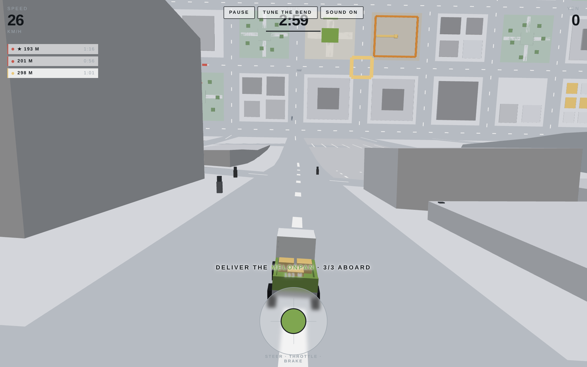

# Melonpan Delivery Service

An arcade delivery game with one idea behind it: **a single continuous camera
view that is street-level perspective near you and a top-down map far ahead,
with no cut or split between them.** You drive a matcha-green kei truck
delivering melonpan across a city that folds up in front of you.

The camera is completely ordinary. The *world* bends.



---

## Running it

```bash
npm install
npm run dev        # http://localhost:5173
```

| Script | What it does |
|---|---|
| `npm run dev` | Vite dev server with hot reload |
| `npm run build` | Typecheck, then build a static site into `dist/` |
| `npm run preview` | Serve the built `dist/` locally |
| `npm test` | 42 headless tests over the rules, the physics and collision |
| `npm run typecheck` | TypeScript, no emit |
| `npm run check` | Typecheck and tests — run this before committing |

`dist/` is plain static files with relative paths, so it drops onto Netlify,
GitHub Pages, Cloudflare Pages or a folder on a web server unchanged.

## Playing it

**WASD** or the arrow keys to drive, **Space** to brake, **Esc** to pause,
**M** to mute, **T** for the bend tuner. On a phone it is the one on-screen
joystick: horizontal steers, vertical is throttle and brake.

**With a controller** — left stick steers, **RT** is throttle and **LT** is the
brake (**A** and **B** work too, for pads with digital triggers). **Start**
pauses, **X** mutes, **Y** opens the bend tuner. On the menus, the **D-pad**
moves between modes and **A** confirms, so you never have to reach for the
screen. The on-screen joystick hides itself once a pad is in use.

Load three crates of melonpan at a bakery, then deliver them. Several orders
are live at once, each with its own countdown; rival couriers are racing you for
the same ones, and roadworks move around the city. Deliveries put time back on
the clock, so a shift lasts exactly as long as you keep earning it.

Three modes:

- **Evening shift** — the standard run. Two rivals, roadworks that move.
- **Rush hour** — shorter clock, tighter orders, four rivals, half the city shut.
- **Free roam** — no clock, no rivals, nothing expires. The sandbox the
  projection was built in. Open this one to look at the view.

## The bend

Everything is transformed into player-local space first (`+Z` straight ahead,
`+Y` up, origin at the truck). Then, per vertex:

- `z < z0` — untouched. Ordinary perspective. This is the street you are on.
- `z >= z0` — the ground follows an arc of radius `R` that rotates it up through
  90°, **preserving arc length**, so the road never stretches or squashes.
- past 90° — it continues as a flat vertical plane, which the camera reads as a
  map.
- A vertex's height is pushed along the arc's normal, so distant buildings lean
  back and show you their roofs — then flattens through the fold, so they arrive
  on the map as footprints rather than as towers pointing at the camera.

It lives in `src/render/shaders.ts` and it is about a dozen lines.

**The bend never leaves `render/`.** Physics, audio, AI, routing and every game
rule run in ordinary unbent world space. That quarantine is the single most
important structural decision in the project: it is what keeps the rest of the
game normal to write, and it is why positional audio and collision were never
complicated by any of this.

Press **Tune the bend** to move all ten parameters live. They are the reason the
current defaults are what they are — every one was found by driving, not by
reasoning. Your settings are saved.

## What the map region is *for*

The design question the project spent its life circling was: what can live in
the plan region that cannot live in the perspective region? Pretty is not an
answer; the answer has to be a **decision only the map supports**. There are
three, and they compound:

1. **Simultaneous orders.** Several drops at once, each with a countdown ring on
   the ground. From the street you see the one you are pointed at. From the map
   you see all of them and choose an order to serve them in.
2. **A capacity limit.** Three crates, refilled at a bakery — so you cannot
   chase whatever is nearest, you have to pick a *cluster* one loop can serve.
   A cluster is a shape, and a shape is only visible from above.
3. **Rivals and closures.** A rival's chevron shows their heading and roughly
   their speed, so every order becomes "can I beat them there". A closure two
   blocks ahead is invisible from the street and obvious from the map.

Because block interiors are drivable, a closure does not stop you — it pushes
you onto the slow pavement cut-through. A cost, not a wall.

A rule falls out of all this: **anything that must be legible in both regions
needs a component built for each.** An objective has a tall pillar for the
street and a flat ring for the map. A closure has bars across the carriageway
and a flat X. A building has a facade and a roof tone that encodes its height.

## Testing it on an iPad with a controller

**Get it onto a URL — no computer required.** `.github/workflows/deploy.yml`
builds and publishes the game on GitHub's own runners, so a phone or an iPad
with a browser is enough to ship a change. One-time setup, doable entirely from
Safari:

> repo → **Settings** → **Pages** → Build and deployment → Source: **GitHub Actions**

That is the whole setup. Every push then publishes to
`https://<user>.github.io/<repo>/`, and the **Actions** tab has a *Run workflow*
button for redeploying without changing anything. The build is gated on the test
suite, so a broken push does not become a broken URL.

The build output uses relative paths throughout, which is why it works from a
project subpath rather than only from a domain root.

If you do have a machine and want a one-off without touching GitHub settings,
`npm run build` produces `dist/`, and dragging that folder onto
[Netlify Drop](https://app.netlify.com/drop) gives you an HTTPS URL with no
account. For a fast iteration loop on the same wifi, `npm run dev -- --host`
prints a LAN address the iPad can open directly.

**Install it to the home screen.** In Safari, Share → *Add to Home Screen*.
Launched from the icon it runs without browser chrome, which is worth a
surprising amount on a device this size — the manifest and the iOS-specific meta
tags are already in place.

**Pair the controller first**, in Settings → Bluetooth (Xbox, DualSense,
Backbone and MFi pads all work). Then, on the title screen:

1. **Tap the screen once.** This matters and is not obvious: a browser will not
   start an AudioContext without a user gesture, and *a gamepad button does not
   count as one*. Any tap anywhere unlocks the sound; without it you would drive
   in silence with nothing to explain why.
2. **Press a button on the pad.** Safari does not report a connected pad at all
   until you do — it will not even fire `gamepadconnected`. The title screen
   says so, and turns green with the pad's name once it sees it.

If the pad is not being seen, pause and look at the **Controller** row on the
pause screen: it shows the detected pad's name, or `press a button`, or flags a
non-standard mapping.

**What to look for**, since both of the project's open risks live on exactly
this device:

- **Motion sickness.** The speed-reactive bend is aggressive by design. If it
  is uncomfortable, drop **Bend intensity** on the pause screen — 0 freezes the
  projection completely, and somewhere in between is the interesting answer.
- **Frame rate.** Vertex count is the constraint here, not fill rate, because
  the bend runs per vertex. **City life** off removes traffic and pedestrians,
  which is the biggest single lever. If it is still short of smooth, the next
  levers are **Map scale** up and **Building height** down in the bend tuner.

## Layout

```
src/
  core/     layout, terrain, palette, maths, projection tuning
  render/   bend shader, geometry builder, city, block archetypes, materials,
            marker batching, chase camera, projection state
  vehicle/  raycast suspension, collision, truck mesh
  world/    routing graph, rivals, traffic, pedestrians
  game/     dispatch, modes, run state machine, persistence
  audio/    bus graph, engine, world sound, music, one-shots
  ui/       HUD, screens, joystick, bend tuner, stylesheet
tests/      headless tests — nothing here touches WebGL or the DOM
```

`bent-city.html` at the root is the original single-file prototype, kept as the
historical record. **It is not the game** and does not receive changes.

`context.md` is the project's memory: every design decision, every trap, and why
the numbers are the numbers. Read it before changing anything structural.

## Things that will bite you

Kept short here; the full list with the stories is in `context.md`.

- **The bend happens per vertex.** A long quad with four corners bends as a
  chord and looks broken. Subdivide along **z** — that is the axis the fold
  consumes. Subdividing vertically is provably free of effect and was costing
  four to nine times the geometry of every tall building.
- **`uBuildH` scales BUILDING height only.** Anything meant to be life size must
  pre-divide by it; anything the truck drives *on* is added after it. This trap
  has been fallen into twice, once for viaducts and once for traffic.
- **Never declare `attribute vec3 color`** in a custom vertex shader. Three.js
  injects it when `vertexColors: true`, and the redefinition fails to compile
  with a blank screen and no useful error.
- **Frustum culling is worse than useless here** — it tests the unbent position.
  Everything bent sets `frustumCulled = false`; tile copies are culled by hand
  in player-local space instead.
- **A moving object cannot be moved with a transform.** Every vertex carries an
  anchor naming the terrain to lift it onto, baked in at build time. Movers are
  re-authored in world space each frame.
- **All positional audio uses unbent world coordinates.** If a sound seems to
  come from where a bent building *looks* like it is, that is the bug.
- **Any full-screen overlay needs `pointer-events: none`,** or it silently eats
  every tap on the page.

## Built with

[three.js](https://threejs.org), [Vite](https://vite.dev), TypeScript and
[Vitest](https://vitest.dev). No art assets, no audio files — the city is
procedural and every sound is synthesised, so the whole thing is one small
download.
